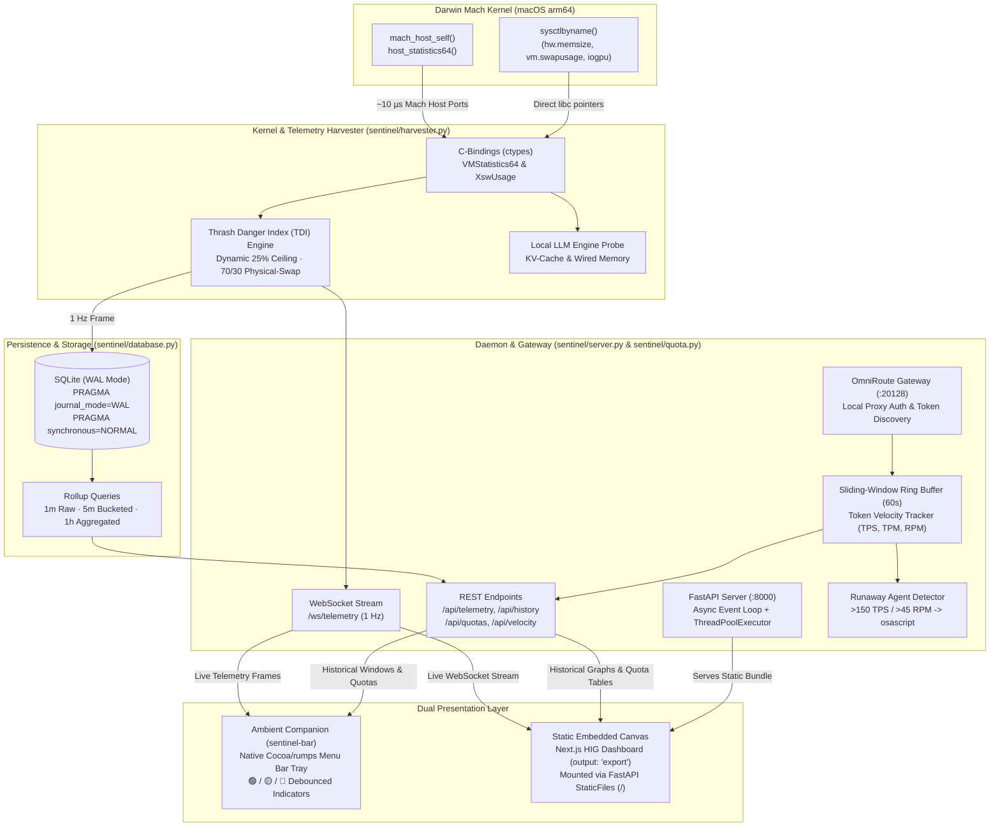
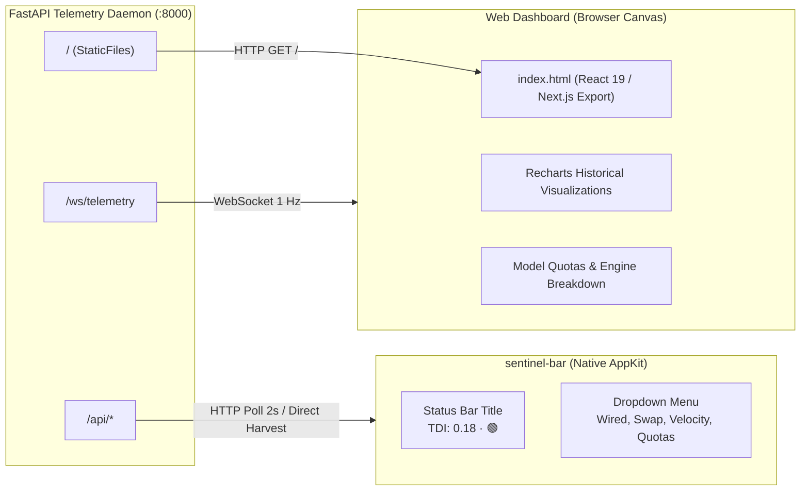

# Sentinel-AI System Engineering Architecture Reference

## 1. System Overview & Topology

Sentinel-AI is a high-performance, native systems monitoring daemon and AI quota telemetry service designed specifically for Apple Silicon macOS (Darwin `arm64`). It addresses the unique memory architecture of Unified Memory Architecture (UMA), where CPU and GPU share a single unified memory pool, making local Large Language Model (LLM) execution and multi-agent autonomous workloads particularly susceptible to memory saturation, kernel thrashing, and quota exhaustion.

The system topology is organized into an asynchronous data acquisition, persistence, and presentation pipeline that operates with near-zero CPU overhead and microsecond-level telemetry latency.

### High-Level Architectural Data Flow



---

## 2. Kernel & Telemetry Layer (`sentinel/harvester.py`)

### 2.1 Near-Zero Latency Darwin Mach Kernel Bindings
Standard macOS monitoring utilities rely on subprocess invocations (`vm_stat`, `sysctl`, `top`) that spawn child processes, allocate process descriptors, execute shell pipelines, and parse string outputs. This incurs an execution penalty of 9.8 ms to 15.0 ms per harvest cycle and exerts non-trivial CPU load.

Sentinel-AI eliminates subprocess spawning entirely during normal operation by binding directly to `/usr/lib/libSystem.B.dylib` using Python's `ctypes` foreign function interface.

#### Mach Host Statistics (`host_statistics64`)
Memory page states are acquired directly from the Mach microkernel subsystem via `mach_host_self()` and `host_statistics64`:

```c
// Underlying Darwin C structure mapped in sentinel/harvester.py
typedef struct vm_statistics64 {
    natural_t free_count;
    natural_t active_count;
    natural_t inactive_count;
    natural_t wire_count;
    uint64_t  zero_fill_count;
    uint64_t  reactivations;
    uint64_t  pageins;
    uint64_t  pageouts;
    uint64_t  faults;
    uint64_t  cow_faults;
    uint64_t  lookups;
    uint64_t  hits;
    uint64_t  purges;
    natural_t purgeable_count;
    natural_t speculative_count;
    uint64_t  decompressions;
    uint64_t  compressions;
    uint64_t  swapins;
    uint64_t  swapouts;
    natural_t compressor_page_count;
    natural_t throttled_count;
    natural_t external_page_count;
    natural_t internal_page_count;
    uint64_t  total_uncompressed_pages_in_compressor;
} vm_statistics64_data_t;
```

Execution profile:
1. `_libc.mach_host_self()` obtains the host port privilege handle.
2. `_libc.host_page_size(host, ctypes.byref(page_size))` resolves hardware page size (16,384 bytes on Apple Silicon).
3. `_libc.host_statistics64(host, HOST_VM_INFO64, ctypes.byref(vm_stat), ctypes.byref(count))` fills the 64-bit struct in a single kernel transition.
4. Total execution latency is reduced to **~10 µs**, representing a ~1000x speedup over `subprocess.run(["vm_stat"])`.

### 2.2 Dynamic Darwin `sysctl` Probes
Operating system swap usage and hardware boundaries are probed via direct calls to `_libc.sysctlbyname`:

- **Hardware RAM (`hw.memsize`)**: 64-bit unsigned integer representing total physical RAM in bytes.
- **Swap Allocation (`vm.swapusage`)**: Mapped to the kernel's `struct xsw_usage`:
  ```python
  class XswUsage(ctypes.Structure):
      _fields_ = [
          ("xsu_total", ctypes.c_uint64),
          ("xsu_avail", ctypes.c_uint64),
          ("xsu_used", ctypes.c_uint64),
          ("xsu_pagesize", ctypes.c_uint32),
          ("xsu_encrypted", ctypes.c_uint32),
      ]
  ```
- **GPU Wired Memory Limits (`iogpu.wired_limit_mb` / `iogpu.wired_mem_limit`)**: Dynamic hardware limit imposed by the macOS Metal driver on wired memory allocations for GPU contexts. On Apple Silicon, if the driver does not expose this dynamic knob, Sentinel-AI falls back to a derived ceiling:
  $$\text{Wired Limit} = \text{round}\left(\frac{\text{hw.memsize}}{1024 \times 1024} \times 0.75, 2\right)\text{ MB}$$

### 2.3 Apple Silicon Hardware Architecture Guardrails
Apple Silicon features Unified Memory Architecture (UMA), where the CPU cores, GPU execution units, Neural Engine (ANE), and memory compressor access the same LPDDR5/LPDDR5X channels.

- **Architecture Detection**: Probed via `platform.machine() == "arm64"` and verified against Darwin OS identifiers.
- **Guardrail Policy**: If non-`arm64` hardware is detected (e.g., Intel Mac or Linux VM fallback):
  * Emits an explicit architecture warning once per process lifecycle.
  * Disables Metal GPU-specific limits and switches to standard Darwin host metrics.
  * Ensures telemetry APIs and WebSocket streams continue operating without kernel-call exceptions.

### 2.4 Thrash Danger Index (TDI) Mathematical Formulation
The **Thrash Danger Index (TDI)** is a normalised scalar in the range $[0.0, 1.0]$ that models instantaneous unified memory thrashing probability.

Traditional monitors use simple percentage thresholds of total RAM. On Apple Silicon, this fails because macOS aggressively wires memory for local LLM weights while maintaining compressed and inactive pages. Furthermore, passive macOS swap caching often keeps 500 MB–2 GB of inactive pages swapped to NVMe even when the system is completely idle.

#### Mathematical Derivation

Let:
- $W$: Wired physical memory in megabytes (`wired_mb`).
- $L_{\text{wired}}$: Effective GPU wired memory limit (`limit_mb`), defaulting to $0.75 \times \text{RAM}_{\text{total}}$.
- $S_{\text{used}}$: Active swap usage in megabytes (`swap_used_mb`).
- $S_{\text{limit}}$: Dynamic RAM-proportional swap ceiling (`swap_limit_mb`).

The dynamic swap ceiling scales as 25% of physical hardware memory with a 2048 MB floor:
$$S_{\text{limit}} = \max\left(2048.0, \text{round}\left(\text{RAM}_{\text{total}} \times 0.25, 2\right)\right)$$

The memory pressure ratio is defined as:
$$R_{\text{mem}} = \frac{W}{L_{\text{wired}}}$$

The swap pressure ratio is defined as:
$$R_{\text{swap}} = \min\left(1.0, \frac{\max(0.0, S_{\text{used}})}{S_{\text{limit}}}\right)$$

#### Saturation Override & 70/30 Blended Evaluation

1. **Physical RAM Saturation Override**:
   If physical wired memory exhausts the allocated limit ($R_{\text{mem}} \ge 1.0$), the system is in immediate danger of process termination (OOM Jetsam). TDI immediately overrides to:
   $$\text{TDI} = 1.0000$$

2. **Nominal & Elevated Blend**:
   When physical memory is below saturation ($R_{\text{mem}} < 1.0$), the index combines physical wired pressure (70% weight) and dynamic swap usage (30% weight):
   $$\text{TDI}_{\text{raw}} = \left(0.70 \times R_{\text{mem}}\right) + \left(0.30 \times R_{\text{swap}}\right)$$

3. **Clamping & Precision**:
   $$\text{TDI} = \text{round}\left(\min\left(1.0, \max\left(0.0, \text{TDI}_{\text{raw}}\right)\right), 4\right)$$

This formulation ensures that a 24 GB Mac sitting with 1.2 GB of cold swap on disk while wired memory is low (~4 GB) produces a safe, nominal score ($\sim 0.22$) instead of triggering false-positive alerts.

---

## 3. Storage & Aggregation Engine (`sentinel/database.py`)

High-frequency telemetry (1 Hz) requires an embedded database capable of non-blocking parallel operations: continuous 1-second inserts from the harvesting loop alongside concurrent analytical reads from the REST API and native menu bar.

### 3.1 SQLite Architecture & Pragma Tuning
Sentinel-AI uses SQLite with Write-Ahead Logging (WAL) enabled:

- **`PRAGMA journal_mode=WAL;`**: Separates writes to a separate `.wal` file, allowing concurrent readers to read snapshots of the database without blocking or being blocked by active writer transactions.
- **`PRAGMA synchronous=NORMAL;`**: Synchronizes WAL file writes only at checkpoint intervals rather than every single write transaction, eliminating disk I/O bottlenecks on NVMe storage.
- **Connection Isolation**: Every database interaction occurs through managed context managers (`_connect`), ensuring connections and file descriptors are recycled immediately.

### 3.2 Relational Schema Design

```sql
CREATE TABLE IF NOT EXISTS telemetry (
    id           INTEGER PRIMARY KEY AUTOINCREMENT,
    timestamp    REAL    NOT NULL,
    wired_mb     REAL    NOT NULL,
    swap_used_mb REAL    NOT NULL,
    pageouts     INTEGER NOT NULL,
    thrash_index REAL    NOT NULL
);

CREATE INDEX IF NOT EXISTS idx_telemetry_timestamp ON telemetry (timestamp);
```

### 3.3 Precomputed Rollup & Analytical Aggregations
To ensure the Next.js frontend renders charts instantaneously without client-side aggregation lag, `get_history_window()` provides three discrete server-side query mechanisms:

1. **1-Minute Window (`1m`)**:
   Returns raw, unbucketed telemetry frames from the last 60 seconds (up to 60 rows), ordered chronologically (`timestamp ASC`).
2. **5-Minute Window (`5m`)**:
   Samples the last 300 seconds using a 5-second integer bucket index:
   ```sql
   SELECT
       CAST((timestamp - :since) / 5 AS INTEGER) AS bucket,
       MIN(timestamp)  AS timestamp,
       AVG(wired_mb)   AS wired_mb,
       AVG(swap_used_mb) AS swap_used_mb,
       CAST(AVG(pageouts) AS INTEGER) AS pageouts,
       AVG(thrash_index) AS thrash_index
   FROM telemetry
   WHERE timestamp >= :since
   GROUP BY bucket
   ORDER BY bucket ASC
   LIMIT 60;
   ```
3. **1-Hour Window (`1h`)**:
   Aggregates the last 3600 seconds into 60-second buckets (up to 60 data points) using standard SQLite `GROUP BY` expressions for maximum compatibility across all platform SQLite builds.
4. **Resilient Data Fallback**:
   If a window query yields 0 rows due to a system restart or timestamp discontinuity, Sentinel-AI falls back to returning the most recent 60 raw rows, guaranteeing that the user interface never displays an empty canvas.

---

## 4. Agent Velocity & Quota Gateway (`sentinel/quota.py`)

Local AI engineers frequently run autonomous agentic loops (e.g., Claude Code, Cursor Composer, OmniRoute, KiloCode). When an agent encounters an unhandled exception or hallucination loop, it can consume hundreds of thousands of tokens within seconds, hitting hard provider rate limits.

### 4.1 OmniRoute Gateway & Cloud Ingestion
Sentinel-AI monitors external and local provider quotas through a tiered gateway:
- **Local OmniRoute Discovery**: Discovers local proxy keys across standard environment locations (`OMNIROUTE_API_KEY`, `~/.omniroute/.env`, `~/.config/omniroute/.env`, `~/.kilocode/.env`).
- **OmniRoute Telemetry Endpoint**: Periodically queries `http://localhost:20128` to extract live provider quota states, token counts, and reset schedules for KiloCode, Cursor Tab, and local engines.
- **Direct Cloud Head Checks**: Probes Anthropic (`/v1/messages` 1-token peek) and OpenAI models endpoints to extract live rate-limit headers (`anthropic-ratelimit-requests-remaining`, `x-ratelimit-remaining-tokens`) with a 30-second TTL cache.
- **Baseline Floor Guarantee**: Sentinel-AI guarantees `get_all_quotas()` never returns an empty array. If external proxies are unreachable, baseline models are loaded to prevent UI layout collapse.

### 4.2 60-Second Sliding-Window Ring Buffer
The `TokenVelocityTracker` maintains a 60-second sliding window ring buffer of tuple records:
$$(t_i, \text{total\_tokens}_i, \text{request\_count}_i)$$

Data points older than $t_{\text{current}} - 60.0\text{ s}$ are pruned on every probe cycle.

#### Metrics Computation
1. **Instantaneous Tokens Per Second (TPS)**:
   Computed between the two most recent samples to capture real-time bursts:
   $$\text{TPS} = \frac{\Delta\text{Tokens}}{\Delta t} = \frac{\text{tokens}_n - \text{tokens}_{n-1}}{\max(t_n - t_{n-1}, 0.0001)}$$
2. **Extrapolated Tokens Per Minute (TPM)**:
   Calculated across the entire rolling active window and projected to 60 seconds:
   $$\text{TPM} = \left(\frac{\text{tokens}_n - \text{tokens}_0}{\max(t_n - t_0, 0.0001)}\right) \times 60.0$$
3. **Rolling Requests Per Minute (RPM)**:
   $$\text{RPM} = \left(\frac{\text{requests}_n - \text{requests}_0}{\max(t_n - t_0, 0.0001)}\right) \times 60.0$$

### 4.3 Runaway Loop Heuristic Engine
The engine classifies velocity into three states: `nominal`, `elevated`, and `runaway`. A runaway condition is flagged when either of the following heuristics is satisfied:

- **Condition A (Sustained High Burn)**:
  $$\text{TPS} > 150.0 \quad \text{for } \Delta t \ge 15.0\text{ consecutive seconds}$$
- **Condition B (Request Flood)**:
  $$\text{RPM} > 45.0 \quad \text{sustained with zero backoff for } \Delta t \ge 10.0\text{ seconds}$$

#### Notification Dispatch & Debouncing
When a runaway condition triggers:
1. `burn_rate_status` transitions to `"runaway"`.
2. A native macOS notification is dispatched using `osascript`:
   ```bash
   osascript -e 'display notification "Agent runaway loop suspected (>150 TPS). Check active sessions." with title "Sentinel-AI Alert"'
   ```
3. A **180-second (3-minute) debounce timer** locks further notifications to prevent desktop notification flooding while the user intervenes.

---

## 5. Service Lifecycle & Daemonization (`sentinel/service.py`)

Sentinel-AI is architected to run continuously in the user's background session without requiring an active terminal window or persistent shell process.

### 5.1 Native macOS `launchd` Orchestration
Process persistence is managed via Apple's native `launchd` service framework. Sentinel-AI automatically configures a user LaunchAgent:
- **Service Label**: `com.sentinel.daemon`
- **Plist Location**: `~/Library/LaunchAgents/com.sentinel.daemon.plist`
- **Logging Directory**: `~/.sentinel/daemon.log` and `~/.sentinel/daemon.err`

#### Plist Configuration
Generated dynamically using Python's native `plistlib` with Apple XML serialization:

```xml
<?xml version="1.0" encoding="UTF-8"?>
<!DOCTYPE plist PUBLIC "-//Apple//DTD PLIST 1.0//EN" "http://www.apple.com/DTDs/PropertyList-1.0.dtd">
<plist version="1.0">
<dict>
    <key>Label</key>
    <string>com.sentinel.daemon</string>
    <key>ProgramArguments</key>
    <array>
        <string>/path/to/.venv/bin/python</string>
        <string>-m</string>
        <string>uvicorn</string>
        <string>sentinel.server:app</string>
        <string>--host</string>
        <string>127.0.0.1</string>
        <string>--port</string>
        <string>8000</string>
    </array>
    <key>WorkingDirectory</key>
    <string>/path/to/sentinel-ai</string>
    <key>RunAtLoad</key>
    <true/>
    <key>KeepAlive</key>
    <true/>
    <key>StandardOutPath</key>
    <string>/Users/.../.sentinel/daemon.log</string>
    <key>StandardErrorPath</key>
    <string>/Users/.../.sentinel/daemon.err</string>
</dict>
</plist>
```

### 5.2 Dynamic Virtualenv Resolution & CLI Interface
The daemon service CLI (`sentinel-service`) provides seamless management:
- **`sentinel-service install`**: Resolves repository root, locates the active virtualenv Python (`.venv/bin/python`), writes the plist, and invokes `launchctl load`.
- **`sentinel-service uninstall`**: Invokes `launchctl unload` and cleans up the LaunchAgent file.
- **`sentinel-service status`**: Probes `launchctl list com.sentinel.daemon` to inspect running PID and exit codes, followed by an HTTP health probe to `http://127.0.0.1:8000/api/telemetry`.
- **`sentinel-service logs`**: Spawns an interactive `tail -f` process on stdout and stderr streams.

---

## 6. Presentation Layer

Sentinel-AI decouples telemetry presentation into two complementary interfaces: an ambient, low-profile companion for passive awareness and an embedded high-density canvas for deep diagnostics.



### 6.1 Ambient Companion: Native Menu Bar Tray (`sentinel/menubar.py`)
Implemented using `rumps` (Python bindings to Apple's AppKit `NSStatusBar` and `NSStatusItem`):
- **Glanceable Icon**: Renders instantaneous TDI and status pills in the macOS menu bar:
  * `🟢` Nominal: $\text{TDI} < 0.30$
  * `🟡` Moderate: $0.30 \le \text{TDI} < 0.70$
  * `🔴` Critical Thrash Risk: $\text{TDI} \ge 0.70$
- **Dropdown Summary**: Provides instant readings for wired VRAM, active swap, pageouts, token burn rate (TPS), and quota health.
- **Daemon Resilience**: If the background FastAPI daemon is stopped, the menu bar app automatically falls back to local Mach kernel C-bindings, ensuring uninterrupted monitoring.

### 6.2 Static Embedded Canvas: Next.js Frontend (`sentinel/web_dist/`)
The visual analytics dashboard is built with Next.js 16, React 19, Tailwind CSS, and Recharts, styled following Apple Human Interface Guidelines (HIG).

- **Static HTML Export**:
  Configured in `web/next.config.ts`:
  ```typescript
  const nextConfig: NextConfig = {
    reactStrictMode: true,
    output: "export",
    images: { unoptimized: true },
    distDir: "../sentinel/web_dist",
  };
  ```
- **Zero-Node Runtime Serving**:
  Compiled assets (`index.html`, `404.html`, `_next/static/**`) are placed directly into `sentinel/web_dist/` during package build. In `sentinel/server.py`, FastAPI serves these static files via Starlette:
  ```python
  dist_dir = Path(__file__).parent / "web_dist"
  if dist_dir.exists() and (dist_dir / "index.html").exists():
      app.mount("/", StaticFiles(directory=str(dist_dir), html=True), name="frontend")
  ```
- **Route Priority**:
  FastAPI route matching guarantees that WebSocket streams (`/ws/*`) and REST endpoints (`/api/*`) are registered first and evaluated with strict priority. Any route not matching an API endpoint falls through to the static frontend handler, serving the Next.js single-page canvas directly.
